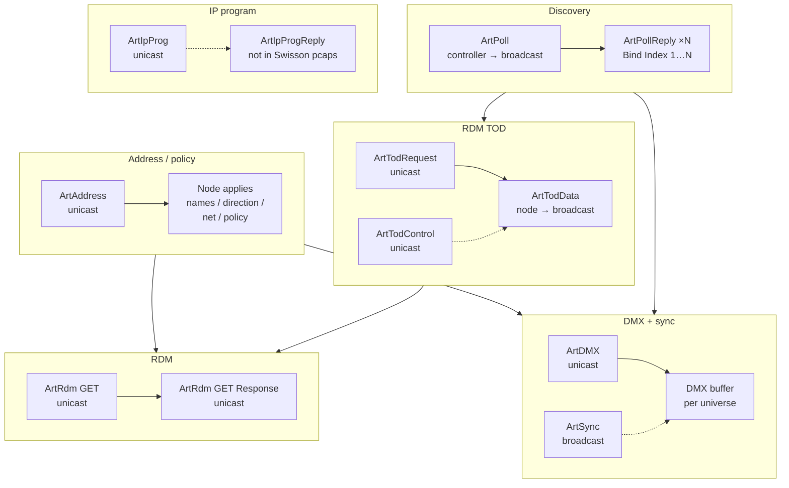

# Art-Net protocol patterns (DMX-Workshop & reference captures)

**Naming:** This document combines **(A)** observed **packet captures** (§0–§1) with **(B)** **Art-Net 4** behaviour and **OpCode** coverage from the official specification. Primary machine-readable source in-repo: **`docs/art-net4.txt`** (extract from the PDF, Artistic Licence). **(B)** is included so the pattern list is **feature-complete** relative to the spec’s major families—not only what appears in the Swisson pcaps. It is still _not_ a full normative substitute for the PDF; field offsets and edge cases must be taken from the specification document.

---

## 0. Reference captures (inventory)

| File                                                                      | Topology                                             | Characterization                                                                                                               |
| ------------------------------------------------------------------------- | ---------------------------------------------------- | ------------------------------------------------------------------------------------------------------------------------------ |
| `wireshark/references/Network_A2R_Swisson_DMXW_03_ConformenceTest.pcapng` | Tester **2.0.0.102**, Swisson **XND-8** **2.0.0.11** | Full **compliance** run: heavy **ArtAddress**, **ArtRdm**, **TOD**, sparse **ArtDMX**.                                         |
| `wireshark/references/Network_A2R_Swisson_DMXW_02.pcapng`                 | Same **2.0.0.102** / **2.0.0.11**                    | **DMX + sync** emphasis: **ArtDMX** unicast to node, **ArtSync** broadcast; lighter **TOD**; **no ArtRdm** in this file.       |
| `wireshark/references/artnet_compliance_test.pcap`                        | **127.0.0.1** loopback                               | **Synthetic** sequence: six frames per OpCode (generator / unit-test style), covering opcodes less common in the Swisson runs. |

_Counts below are exact per file (`tshark -Y artnet -T fields -e artnet.header.opcode | sort | uniq -c`). Wireshark labels should be checked against the Art-Net 4 PDF for authoritative names._

---

## 1. Packet types seen (by file)

### 1.1 `DMXW_03` — `Network_A2R_Swisson_DMXW_03_ConformenceTest.pcapng` (4577 Art-Net frames)

| OpCode (LE) | Name (Wireshark) | Count | Role                                     |
| ----------- | ---------------- | ----- | ---------------------------------------- |
| 0x2000      | ArtPoll          | 170   | Discovery; triggers replies.             |
| 0x2100      | ArtPollReply     | 2698  | Identity per **Bind Index** (8 ports).   |
| 0x5000      | ArtDMX           | 12    | Streaming DMX to a universe.             |
| 0x6000      | ArtAddress       | 1107  | Names, direction, net/sub-net, policies. |
| 0x8000      | ArtTodRequest    | 48    | Request RDM **TOD**.                     |
| 0x8100      | ArtTodData       | 123   | TOD payload (often broadcast).           |
| 0x8200      | ArtTodControl    | 48    | TOD maintenance (e.g. flush).            |
| 0xF800      | ArtIpProg        | 24    | IP programming / probe bursts.           |
| 0x8300      | ArtRdm           | 347   | RDM over Art-Net (GET / response).       |

**Not observed here:** `ArtIpProgReply` (0xF900), `ArtSync`, `ArtInput`, etc.

### 1.2 `DMXW_02` — `Network_A2R_Swisson_DMXW_02.pcapng` (1659 Art-Net frames)

| OpCode (LE) | Name (Wireshark) | Count | Role                                                                    |
| ----------- | ---------------- | ----- | ----------------------------------------------------------------------- |
| 0x2000      | ArtPoll          | 76    | Discovery.                                                              |
| 0x2100      | ArtPollReply     | 672   | Port-scoped replies.                                                    |
| 0x5000      | ArtDMX           | 433   | **Unicast** to **2.0.0.11** (all 433).                                  |
| 0x5200      | ArtSync          | 400   | **Broadcast** to **2.255.255.255** — end-of-frame sync.                 |
| 0x6000      | ArtAddress       | 36    | Remote programming (e.g. long name **SWISSON XND-8** on bind **0x01**). |
| 0x8000      | ArtTodRequest    | 8     | TOD request.                                                            |
| 0x8100      | ArtTodData       | 18    | TOD data to broadcast.                                                  |
| 0x8200      | ArtTodControl    | 8     | TOD control.                                                            |
| 0xF800      | ArtIpProg        | 8     | IP programming (paired with TOD in opening sequence).                   |

**Not observed here:** **ArtRdm** (0x8300). **No** **0xF900** (ArtIpProgReply).

**Addressing pattern (DMX vs Sync):** **ArtDMX** → **unicast** node IP; **ArtSync** → **directed IPv4 broadcast** (same subnet style as **ArtPoll**).

### 1.3 `artnet_compliance_test.pcap` (60 Art-Net frames, loopback)

Six samples each: **ArtPoll**, **ArtPollReply**, **ArtDMX**, **ArtSync**, **ArtAddress**, **ArtCommand** (0x2400), **ArtInput** (0x7000), **ArtTrigger** (0x9900), **ArtIpProg**, **ArtDataRequest** (0x2700). **No** **ArtDataReply** (0x2800) in this file.

_Use case:_ quick **parser/builder** coverage or regression vectors; not representative of a real fixture conversation.

### 1.4 Art-Net 4 — specification baseline (all `lumenflow_core` OpCodes)

The following **matches `lumenflow_core::artnet::OpCode`** (the crate’s supported set). The **Art-Net 4 PDF** remains authoritative for field layouts; if a future spec revision adds opcodes **not** in this enum, they would appear in the PDF first—then **extend the enum** and this table.

| OpCode (LE) | Name                | Spec domain / role (summary)                                                                                                                                         |
| ----------- | ------------------- | -------------------------------------------------------------------------------------------------------------------------------------------------------------------- |
| 0x2000      | ArtPoll             | Discovery; **TalkToMe** flags (e.g. reply-on-change, diagnostics, **targeted** poll with port/OEM filters).                                                          |
| 0x2100      | ArtPollReply        | Node identity; **Bind Index**; **Port Name** (per-port label, spec) and **Long Name**; port types; **15-bit** address fields (**Net**, **SubUni**).                  |
| 0x2300      | ArtDiagData         | **Diagnostics** text stream to controllers (priority, UTF-8 payload).                                                                                                |
| 0x2400      | ArtCommand          | **OEM / remote** text command channel.                                                                                                                               |
| 0x2700      | ArtDataRequest      | Request **OEM file / blob** data (paired with **ArtDataReply**).                                                                                                     |
| 0x2800      | ArtDataReply        | Response carrying **file fragment** or status.                                                                                                                       |
| 0x5000      | ArtDMX              | DMX payload **Length** 2–512 bytes (even); **Sequence**; **Physical**; **15-bit** Port-Address (not always full 512 slots).                                          |
| 0x5100      | ArtNzs              | **Non-zero start code** DMX (RDM, text, etc.—**NZS**).                                                                                                               |
| 0x5200      | ArtSync             | **Synchronised** output: nodes compare **ArtSync** source IP to the **most recent ArtDMX** source IP **for that synchronisation domain** (not an arbitrary pairing). |
| 0x6000      | ArtAddress          | Remote programming: **Port Name** + **Long Name** (per PDF), **Net/Sub**, merge/RDM flags, **Command** nibble.                                                       |
| 0x7000      | ArtInput            | Controller advertises **input** port levels to the network.                                                                                                          |
| 0x8000      | ArtTodRequest       | Request **RDM TOD** for a universe.                                                                                                                                  |
| 0x8100      | ArtTodData          | **TOD** publish (often broadcast).                                                                                                                                   |
| 0x8200      | ArtTodControl       | **TOD** maintenance (flush, etc.).                                                                                                                                   |
| 0x8300      | ArtRdm              | **RDM** tunnel; same OpCode for request/response (inner RDM differs).                                                                                                |
| 0x8400      | ArtRdmSub           | **Sub-device** RDM path.                                                                                                                                             |
| 0x9000      | ArtMedia            | **Media** streaming (general).                                                                                                                                       |
| 0x9100      | ArtMediaPatch       | **Media** patch / mapping.                                                                                                                                           |
| 0x9200      | ArtMediaControl     | **Media** control.                                                                                                                                                   |
| 0x9300      | ArtMediaContrlReply | **Media** control reply.                                                                                                                                             |
| 0x9700      | ArtTimeCode         | **SMPTE / EBU** timecode distribution.                                                                                                                               |
| 0x9800      | ArtTimeSync         | **Time sync** / wall-clock alignment (distinct from **ArtSync** 0x5200).                                                                                             |
| 0x9900      | ArtTrigger          | **Show control** / macro triggers.                                                                                                                                   |
| 0x9A00      | ArtDirectory        | **Directory** request (list assets).                                                                                                                                 |
| 0x9B00      | ArtDirectoryReply   | **Directory** response.                                                                                                                                              |
| 0xA010      | ArtVideoSetup       | **Pixel mapping** / video setup.                                                                                                                                     |
| 0xA020      | ArtVideoPalette     | **Palette** data.                                                                                                                                                    |
| 0xA040      | ArtVideoData        | **Video** frame payload.                                                                                                                                             |
| 0xF000      | ArtMacMaster        | **Remote MAC** / identification programming (master).                                                                                                                |
| 0xF100      | ArtMacSlave         | **Remote MAC** (slave reply).                                                                                                                                        |
| 0xF200      | ArtFirmwareMaster   | **Firmware upload** (master).                                                                                                                                        |
| 0xF300      | ArtFirmwareReply    | **Firmware** reply / progress.                                                                                                                                       |
| 0xF400      | ArtFileTnMaster     | **File transfer** (Tn).                                                                                                                                              |
| 0xF500      | ArtFileFnMaster     | **File transfer** (Fn).                                                                                                                                              |
| 0xF600      | ArtFileFnReply      | **File transfer** reply.                                                                                                                                             |
| 0xF800      | ArtIpProg           | **IP / DHCP** programming.                                                                                                                                           |
| 0xF900      | ArtIpProgReply      | **IP programming** reply.                                                                                                                                            |

**Spec transport rules (PDF / common implementation practice):**

- **UDP port 6454**; single socket send/receive; **ProtVer** in header is **big-endian** **14** for packets that carry it; **OpCode** is **little-endian**.
- **15-bit Port-Address:** **Net** (bits 14–8), **Sub-Net** (7–4), **Universe** (3–0)—decode as in `ARTNET_SPEC_ASSESSMENT.md` / `decode_port_address`.
- **Directed broadcast** for discovery (spec examples): **2.255.255.255**, **10.255.255.255**, **127.255.255.255**; real **192.168.x.x** LANs usually need the **subnet** broadcast address.
- **ArtPoll** minimum length and **ArtPollReply** **207–239** byte variants (Art-Net 3/4 interoperability).
- **ArtPollReply** timing: spec recommends a **random 0–1 s** delay before reply to reduce **broadcast storms** when many nodes answer.
- **ArtDMX Sequence:** **0x00** disables re-ordering; non-zero **sequence** should be handled in order (see robustness notes in `ARTNET_SPEC_ASSESSMENT.md`).
- **ArtSync vs ArtDMX source IP:** nodes shall **ignore ArtSync** unless its **source IP** matches the **source IP of the most recent ArtDMX** for that synchronisation domain (quoted behaviour already noted in §4.6).

### 1.5 Art-Net 4 text (`docs/art-net4.txt`) — behaviours beyond §1.4 tables

These items are spelled out in the specification text; they were **not** fully captured in §1 pcaps alone.

| Theme                                  | Spec pattern (summary)                                                                                                                                                                                                                                                                                           |
| -------------------------------------- | ---------------------------------------------------------------------------------------------------------------------------------------------------------------------------------------------------------------------------------------------------------------------------------------------------------------- |
| **Kiloverse**                          | A **Kiloverse** is a group of **1024** universes (terminology section).                                                                                                                                                                                                                                          |
| **ArtPoll timing**                     | Controllers should send **ArtPoll** every **2.5–3 s**; assume **≤ 3 s** timeout waiting for **ArtPollReply** before treating a node as disconnected. **Valid ArtPoll** length is **≥ 14 bytes** (missing fields zero).                                                                                           |
| **ArtPollReply delay**                 | Node should wait **random 0–1 s** before sending **ArtPollReply** (reduces broadcast bunching).                                                                                                                                                                                                                  |
| **Controller self-reply**              | The controller that broadcasts **ArtPoll** should also **unicast ArtPollReply to itself** (spec requirement).                                                                                                                                                                                                    |
| **Multiple controllers + diagnostics** | If any controller requests diagnostics, the node sends diagnostics; if several do, diagnostics are **broadcast**; use **lowest** **DiagPriority**; ignore unicast-diag flag when multiple controllers conflict (see **ArtPoll** flags).                                                                          |
| **ArtDMX transport**                   | **ArtDmx** must be **unicast** to **subscribers** of that universe; **broadcast ArtDmx is not allowed**. If **no subscribers**, the controller **shall not** send **ArtDmx**. Subscribers advertise universes in **SwIn** / **SwOut** in **ArtPollReply**; transmitters **poll** to detect subscription changes. |
| **Input retransmit**                   | Active non-changing DMX input re-sends last **ArtDmx** about every **4 s** (spec); **800 ms–1000 ms** recommended to align Art-Net with **sACN** convergence.                                                                                                                                                    |
| **RefreshRate**                        | **ArtPollReply** **RefreshRate** declares the **maximum** rate a gateway can accept **ArtDmx** (DMX-out often **44 Hz**; non-DMX gateways may be higher).                                                                                                                                                        |
| **Merge**                              | Two **ArtDmx** sources to the same **Port-Address** (different IP or same IP different **Physical**) → **merge**; **GoodOutput** bit 3 set; **LTP/HTP** via **ArtAddress**; **at most two** sources; exit via **AcCancelMerge** and rules in §4.5.                                                               |
| **ArtVlc**                             | **ArtVlc** is **not** a separate OpCode in Table 1—it is a **specific use** of **ArtNzs** (**OpNzs 0x5100**) for **VLC** payloads (Visible Light Communication). **ArtPoll** flag enables/disables VLC transmission.                                                                                             |
| **OpMacMaster/Slave**                  | Table 1 marks **0xF000** / **0xF100** as **deprecated**.                                                                                                                                                                                                                                                         |
| **NodeReport**                         | **ArtPollReply** **NodeReport** carries status (e.g. **RcShNameOk** / **RcLoNameOk** confirm **ArtAddress** programming success for Port Name / Long Name). See §4.19.                                                                                                                                           |
| **Style codes**                        | **ArtPollReply** **Style**: e.g. **StNode**, **StController**, **StMedia**, **StRoute**, **StBackup**, **StConfig**, **StVisual**—device class hint for controllers.                                                                                                                                             |

---

## 2. Logical blocks (cross-capture)

### 2.1 Discovery and device identity

- **ArtPoll** from tester → **2.255.255.255** (and sometimes **255.255.255.255** in DMXW_03).
- **ArtPollReply** from node → often same directed broadcast; **eight** replies with **Bind Index 0x01…0x08**, **Port Name** fields **Port 1…Port 8** in captures (DMXW_03 / DMXW_02).
- **ArtPollReply** is **unicast** per Art-Net 4 (**broadcast reply not allowed**); the Swisson pcaps may still show **directed broadcast** replies from some stacks—treat as **implementation variance**, not the normative rule.

### 2.2 RDM discovery transport (TOD) — DMXW_03 (heavy), DMXW_02 (light)

- **ArtTodRequest** (unicast tester → node) → **ArtTodData** (node → broadcast).
- **ArtTodControl** (unicast) e.g. **AtcFlush**; observe subsequent **ArtTodData** / RDM behavior.

### 2.3 Addressing (ArtAddress)

- **Bind Index** selects **root vs port** context; **Port Name** / **Long Name** (see §4.1 terminology), **Command** (direction, locate, no-action, etc.), **Net** / **Sub-Net** program fields (DMXW_03 stress; DMXW_02 includes e.g. long name **SWISSON XND-8**).

### 2.4 DMX streaming + frame sync — DMXW_02

- **ArtDMX** continuous **unicast** to the node.
- **ArtSync** **broadcast** following/between DMX bursts (spec: synchronize output across nodes sharing the sync domain).

### 2.5 RDM over Art-Net — DMXW_03 only (among these Swisson captures)

- **ArtRdm** request vs response (same OpCode **0x8300**; distinguish inner RDM).

### 2.6 IP programming (ArtIpProg)

- Present in all three files; **ArtIpProgReply** not seen in the Swisson pcaps.

---

## 3. Detailed protocol flow (Mermaid)

Dependency-oriented (not strict chronology). **DMXW_02** adds the **ArtSync** branch next to **ArtDMX**.

**DMXW_03 timeline (typical):** Poll → 8× PollReply → TOD loop → heavy ArtAddress → ArtRdm → sparse ArtDMX; **ArtPoll** repeats.

**DMXW_02 timeline (typical):** Poll → 8× PollReply → TOD/IP probe → sustained **ArtDMX** + **ArtSync**; **ArtAddress** appears later in the file.

---

## 4. Protocol interaction patterns (detailed)

Each pattern uses the same structure: **function → description → call → response / effect → outcomes → LumenFlow Core ideas.**

### 4.1 Discover nodes and list ports

**Terminology (Art-Net 4 vs tools):** The PDF defines **Port Name** as the null-terminated name **for each port** of the node. The controller programs it with **ArtAddress**; **max length is 17 characters plus the null**; the field is **fixed length** on the wire although the string may be shorter. **Long Name** is the separate node description field. Many manufacturers and tools (including Wireshark) label the same 18-byte **ArtPollReply** / **ArtAddress** slot **“Short Name”**; **`lumenflow_core`** exposes it as `short_name`. That label is **misleading** for spec intent: treat the value as the **Port Name** for the **Bind Index** in use, not generically as a “short node name,” unless you have confirmed device behaviour.

- **Description:** The controller sends **ArtPoll** so nodes announce themselves. Multi-port devices answer with **one ArtPollReply per Bind Index** (here **eight** for XND-8). The controller learns the node IP, **Long Name** of the device, and **Port Name** for the port represented by that reply. Per spec, **Port Name** is the **per-port** label (programmed via **ArtAddress**). When **several** **ArtPollReply** messages are used—each with its own **Bind Index**—each **Port Name** applies to **that** reported port. When a device sends **only one** **ArtPollReply** for multiple physical ports, UIs often show **one** string with a numeric suffix (**Port 1**, **Port 2**, …) or similar; that is a **presentation** choice—the wire still carries the spec **Port Name** field for that reply. The controller also learns **NumPorts**, port types, and **15-bit** universe routing (**Net** / **SubUni** / **SwIn** / **SwOut**) without changing device state.

- **Call packet**

  | Field    | Value (typical)                                                               |
  | -------- | ----------------------------------------------------------------------------- |
  | Sender   | Controller (e.g. **2.0.0.102**)                                               |
  | Receiver | IPv4 **directed broadcast** (**2.255.255.255**) or global **255.255.255.255** |
  | Type     | **ArtPoll** (0x2000)                                                          |
  | Data     | **TalkToMe**, priority, optional targeting fields per spec                    |

- **Response packet(s)**

  | Field    | Value (typical)                                                                                                                                    |
  | -------- | -------------------------------------------------------------------------------------------------------------------------------------------------- |
  | Sender   | Node (e.g. **2.0.0.11**)                                                                                                                           |
  | Receiver | Often same broadcast as poll; may be **unicast** to controller                                                                                     |
  | Type     | **ArtPollReply** (0x2100), **one per Bind Index**                                                                                                  |
  | Data     | **Port Name** (spec; often shown as “Short Name” in Wireshark), **Long Name**, **Bind Index**, **NumPorts**, **SwIn/SwOut**, MAC, **Status**, etc. |

- **Successful outcome:** At least one **ArtPollReply** with valid header (**Art-Net\0**, OpCode **0x2100**) and expected **Bind Index** range for the device class.
- **Unsuccessful outcome:** No reply (wrong subnet, firewall, port **6454** conflict), or parser rejects payload (ArtPollReply shorter than minimum length or corrupt ID).
- **Core API ideas:** Treat discovery as **event-driven**: upsert `DeviceInfo` on each **ArtPollReply** keyed by **(ip, bind_index)**. Map the wire **Port Name** semantics to `short_name_str()` knowing the Rust name is historical. Do not await a single “discovery promise”—merge **multiple** replies for one physical IP.

---

### 4.2 Program Port Name and Long Name (ArtAddress)

- **Description:** The controller programs **Port Name** and/or **Long Name** using **ArtAddress** (the PDF states **ArtAddress** is used to program the **Port Name** string). Use **Bind Index** to select the **root** vs **port** context. The wire protocol **does not define** an Art-Net ACK. Verify by sending **ArtPoll** again and checking **ArtPollReply**, or the device’s front panel.
- **Call packet**

  | Field    | Value (typical)                                                                                                                                                                                                 |
  | -------- | --------------------------------------------------------------------------------------------------------------------------------------------------------------------------------------------------------------- |
  | Sender   | Controller                                                                                                                                                                                                      |
  | Receiver | Node **unicast** IP                                                                                                                                                                                             |
  | Type     | **ArtAddress** (0x6000)                                                                                                                                                                                         |
  | Data     | **Bind Index**, **Port Name** (18-byte field; `short_name` in **`build_art_address`**), **Long Name**, **Input/Output Subswitch** nibbles, **Command** (e.g. set direction, no-action), **sACN Priority**, etc. |

- **Response packet**

  | Field            | Value                                                                                                                                         |
  | ---------------- | --------------------------------------------------------------------------------------------------------------------------------------------- |
  | _Immediate_      | **None** on the wire (not part of Art-Net 4 as a mandatory paired reply).                                                                     |
  | **Verification** | Subsequent **ArtPoll** → **ArtPollReply** where **Long Name** / **Port Name** reflect the programmed strings if the node accepted the change. |

- **Successful outcome:** A later **ArtPollReply** shows the **new** **Port Name** / **Long Name**; optionally **NodeReport** **RcShNameOk** / **RcLoNameOk** (§4.19)—**not all** nodes emit these codes.
- **Unsuccessful outcome:** **ArtPollReply** still shows **old** **Port Name** / **Long Name**; or **timeout**; or node rejects (firmware policy)—indistinguishable on the wire without device-specific error channels.
- **Core API ideas:** Expose `build_art_address` as **fire-and-forget**, then either: (1) **schedule ArtPoll** and resolve a **configuration task** only when a matching **ArtPollReply** arrives with expected **Port Name** / **Long Name**, or (2) return success on **send** and let the registry update **only** from observed **ArtPollReply** (never optimistically overwrite cached **Port Name** / **Long Name** until confirmed). Parameter names in code remain `short_name` / `long_name` until renamed in a dedicated API refactor.

---

### 4.3 RDM Table of Devices (TOD)

- **Description:** The controller requests the RDM device list for a universe using **ArtTodRequest**. The node publishes **ArtTodData** (often **broadcast**). **ArtTodControl** can flush or manage TOD state before/after discovery.
- **Call packet**

  | Field    | Value (typical)                                           |
  | -------- | --------------------------------------------------------- |
  | Sender   | Controller                                                |
  | Receiver | Node **unicast**                                          |
  | Type     | **ArtTodRequest** (0x8000)                                |
  | Data     | **Net**, **Command** (e.g. TodFull), universe **Address** |

- **Response / publish**

  | Field    | Value (typical)                                                                           |
  | -------- | ----------------------------------------------------------------------------------------- |
  | Sender   | Node                                                                                      |
  | Receiver | **Directed broadcast** / Ethernet broadcast (not necessarily the controller’s unicast IP) |
  | Type     | **ArtTodData** (0x8100)                                                                   |
  | Data     | **Bind Index**, **Universe**, **UID** list / counts, **Command Response**                 |

- **Successful outcome:** **ArtTodData** received with coherent **Universe** / **Bind Index** and expected **TodFull** / UID fields for the test scenario (DMXW_03: many frames; DMXW_02: fewer).
- **Unsuccessful outcome:** No **ArtTodData** after request; or **UID Count** zero when fixtures are expected (may still be valid if no RDM gear on the port).
- **Core API ideas:** When implementing TOD, **listen on broadcast** as well as unicast; correlate by **universe** + **Bind Index**. Parser support for TOD opcodes is currently **Unimplemented** in the main dispatch path—plan explicit handlers before exposing to UI.

---

### 4.4 RDM commands (ArtRdm)

- **Description:** The controller encapsulates **RDM** (e.g. **GET Supported Parameters**) in **ArtRdm** to the node’s IP; the node returns **ArtRdm** with **Response type Ack** and RDM **GET Response** payload (DMXW_03).
- **Call packet**

  | Field    | Value (typical)                                                                             |
  | -------- | ------------------------------------------------------------------------------------------- |
  | Sender   | Controller                                                                                  |
  | Receiver | Node **unicast**                                                                            |
  | Type     | **ArtRdm** (0x8300)                                                                         |
  | Data     | RDM **Dst UID**, **Src UID**, **Command class** GET, **Parameter ID**, universe **Address** |

- **Response packet**

  | Field    | Value (typical)                                               |
  | -------- | ------------------------------------------------------------- |
  | Sender   | Node                                                          |
  | Receiver | Controller **unicast**                                        |
  | Type     | **ArtRdm** (0x8300)                                           |
  | Data     | RDM **Response type**, **GET Response**, parameter data block |

- **Successful outcome:** Matching **Transaction number** / UID pairing and **Ack** with requested parameter data.
- **Unsuccessful outcome:** **NACK** or timeout; lost UDP; RDM checksum error (Wireshark flags).
- **Core API ideas:** Track **request/response** symmetry for latency metrics; parse inner RDM only when **ArtRdm** dispatch is implemented.

---

### 4.5 Stream DMX to a universe (ArtDMX)

- **Description:** The controller sends **ArtDMX** (**OpOutput / OpDmx 0x5000**) with **15-bit Port-Address**, **Length** (even, 2–512 bytes of channel data), **Sequence**, and **Physical**. The node maps data to the DMX output for that universe; there is **no** Art-Net application ACK.

- **Unicast subscription (spec):** **ArtDmx** must be **unicast** to devices that **subscribe** to that universe. Subscribers list universes in **SwIn** / **SwOut** in **ArtPollReply**; the transmitter **polls** so subscription changes are discovered. If **no** node subscribes to a universe, the controller **shall not** send **ArtDmx** for it. **Broadcast ArtDmx is not allowed** (`docs/art-net4.txt`, ArtDmx packet strategy). _(Lab captures may still show unicast to a known node, which matches this behaviour.)_

- **Sequence:** **0x00** disables re-ordering; **0x01–0xFF** increments so receivers can re-sequence over lossy paths.

- **Physical:** Distinguishes multiple inputs with the same Port-Address for **merging** (see below).

- **Refresh rate:** **ArtPollReply** **RefreshRate** tells controllers the **maximum** rate the gateway accepts (DMX512 out is often capped at **44 Hz**; other gateway types may allow higher).

- **Data merging (spec):** If **ArtDmx** for the **same Port-Address** arrives from **two different IP addresses**, or from the **same IP** with **different Physical** values, the node may **merge** (**LTP** or **HTP** per **ArtAddress**). **At most two** sources; more are ignored. **GoodOutput** bit 3 indicates merge active. Exit: **ArtAddress AcCancelMerge**, or loss of sources with **10 s** hold behaviour per spec. Nodes should document behaviour in the user guide.

- **Synchronous output:** Multi-universe **frame** alignment uses **ArtSync** (§4.6), not **ArtTimeSync**.

- **Call packet**

  | Field    | Value (DMXW_02 / DMXW_03)                                                                 |
  | -------- | ----------------------------------------------------------------------------------------- |
  | Sender   | Controller (**2.0.0.102**)                                                                |
  | Receiver | Node **unicast** (**2.0.0.11**) — DMXW_02: **all** ArtDMX to unicast                      |
  | Type     | **ArtDMX** (0x5000)                                                                       |
  | Data     | **Sequence**, **Physical**, **SubUni** / **Net** (Port-Address), **Length**, DMX **Data** |

- **Response packet**

  | Field      | Value                                        |
  | ---------- | -------------------------------------------- |
  | _Art-Net_  | **None**                                     |
  | _Physical_ | DMX **output** on port (not visible in pcap) |

- **Successful outcome:** Stable stream; subscription satisfied; merge state reflected in **ArtPollReply** if applicable.
- **Unsuccessful outcome:** Wrong universe mapping; sequence gaps; violation of unicast-only rule on some networks; no electrical DMX (out of scope for capture).
- **Core API ideas:** `UniverseStore::update` for ingest; `build_art_dmx` for transmit. Controllers should **track subscribers** from **ArtPollReply** before flooding universes. Implement merge detection if analysing **multi-controller** sites.

---

### 4.6 End-of-frame synchronization (ArtSync) — DMXW_02

- **Description:** The controller sends **ArtSync** so nodes buffer **ArtDmx** and release to outputs together. In DMXW_02, **ArtSync** is **directed broadcast** while **ArtDmx** is **unicast**—different L3 destinations. **Art-Net 4:** compare **ArtSync** source IP to the **most recent ArtDmx** source IP; **ignore** if they differ. **When a port is merging ArtDmx from different IP addresses, ArtSync packets shall be ignored** (spec, **Multiple controllers** under **ArtSync**).
- **Call packet**

  | Field    | Value (DMXW_02)                                    |
  | -------- | -------------------------------------------------- |
  | Sender   | Controller (**2.0.0.102**)                         |
  | Receiver | **2.255.255.255** (all **400** **ArtSync** frames) |
  | Type     | **ArtSync** (0x5200)                               |
  | Data     | **Aux** (often 0), 14-byte payload class           |

- **Response packet:** **None** on the wire.
- **Successful outcome:** Node(s) honor sync policy; observable only via **lighting timing** or device-specific diagnostics—not via a reply packet.
- **Unsuccessful outcome:** Broadcast blocked by AP/client isolation; sync ignored by devices that do not implement **ArtSync**.
- **Core API ideas:** `build_art_sync`; `SyncDetector` for **receive-side** analysis. If building a controller, decide **broadcast vs unicast** for sync per network constraints (this capture uses **broadcast**). On receive, buffer **ArtDMX** by source IP and only commit output when a matching-source **ArtSync** arrives if implementing spec-style **synchronised** output.

---

### 4.7 IP configuration (ArtIpProg / ArtIpProgReply)

- **Description:** The controller sends **ArtIpProg** to read or write IP, mask, gateway, DHCP flags when **Enable Programming** is set per spec. The node should answer with **ArtIpProgReply** (0xF900).
- **Call packet**

  | Field    | Value (typical)                                                                                |
  | -------- | ---------------------------------------------------------------------------------------------- |
  | Sender   | Controller                                                                                     |
  | Receiver | Node **unicast**                                                                               |
  | Type     | **ArtIpProg** (0xF800)                                                                         |
  | Data     | Command bits (**Program IP**, **Enable DHCP**, etc.), proposed **IP**, **Subnet**, **Gateway** |

- **Response packet**

  | Field    | Value                               |
  | -------- | ----------------------------------- |
  | Sender   | Node                                |
  | Receiver | Controller **unicast**              |
  | Type     | **ArtIpProgReply** (0xF900)         |
  | Data     | Current/proposed IP fields per spec |

- **Successful outcome:** **ArtIpProgReply** matches expectation after programming window (not seen in Swisson pcaps—likely programming mode off or reply not captured).
- **Unsuccessful outcome:** No reply; or reply shows old addressing.
- **Core API ideas:** Parse **both** **ArtIpProg** and **ArtIpProgReply**; expose async **send + await reply** with timeout when implementing controller workflows.

---

### 4.8 Synthetic capture opcodes (`artnet_compliance_test.pcap`)

Short reference for opcodes **not** heavily exercised on Swisson in these files:

| Function                    | Call (127.0.0.1)            | Typical role                                                   | Core API                                   |
| --------------------------- | --------------------------- | -------------------------------------------------------------- | ------------------------------------------ |
| **OEM / text command**      | **ArtCommand** (0x2400)     | Vendor-specific remote commands                                | `build_art_command`, parse                 |
| **Controller input state**  | **ArtInput** (0x7000)       | Report DMX **input** ports to network                          | parse / build                              |
| **Show trigger**            | **ArtTrigger** (0x9900)     | Macro / cue triggers                                           | `build_art_trigger`, parse                 |
| **File / OEM data request** | **ArtDataRequest** (0x2700) | Request blob; expect **ArtDataReply** (0x2800) on real devices | `build_art_data_request`, parse reply path |

- **Successful outcome (tests):** Parser accepts the captured payloads without `UnknownOpCode`.
- **Unsuccessful outcome:** `Unimplemented` in core dispatch until handlers are wired.
- **Core API ideas:** Use this pcap as a **fixture** for widening the main `ArtNetParser` match arms over time.

---

### 4.9 Diagnostics (ArtDiagData — 0x2300)

- **Description:** **Primarily node → controller:** **priority-rated** diagnostic text. The spec defines **Data** as an **ASCII** text array (max **512** bytes including null); some implementations emit UTF-8—treat as bytes and decode carefully. Controllers may **request** behaviour via **ArtPoll** **TalkToMe** (“send diagnostics”) flags; do not assume symmetric controller-originated **ArtDiagData** is common.
- **Call / publish:** Sender = **node** (typical); Receiver = **unicast** to poller or **broadcast** (implementation-dependent); Type = **ArtDiagData**; Data = priority + text payload.
- **Response:** None; **event stream**.
- **Success / failure:** Subjective (log ingestion); spec says **ASCII**—reject or strip non-ASCII if strict.
- **Core API ideas:** Parser in **`crates/lumenflow_core/src/artnet/diag.rs`** (dispatch **`mod.rs`**); wire UI to a rolling **diag** buffer; respect **TalkToMe** when acting as a node.

---

### 4.10 Non-zero start code DMX (ArtNzs — 0x5100) and VLC

- **Description:** **OpNzs** (**0x5100**) carries **non-zero start code** DMX512 for one universe; Table 1 describes it as **non-zero start code (except RDM)**—**RDM** control/discovery uses **ArtRdm** / **TOD**, not **ArtNzs** as the main RDM carrier. **ArtVlc** is **not** a separate OpCode in Table 1: the spec defines **ArtVlc** as a **specific use of ArtNzs** for **VLC** (Visible Light Communication); **ArtPoll** flags include enable/disable **VLC transmission**.
- **Call:** Controller → node (typical); Type = **ArtNzs**; Data = **15-bit** address, **Sequence**, **start code**, DMX payload.
- **Response:** None on wire; physical layer outputs NZS DMX.
- **Success:** Fixture accepts **non-zero** start code allowed by **ArtNzs**; **failure:** wrong **length** or disallowed start code. **Do not** treat **ArtNzs** as the primary carrier for **RDM** line data—use **ArtRdm** / **TOD** for RDM over Art-Net. **ArtVlc** uses **OpNzs** with VLC-specific framing (see **ArtVlc** section in `docs/art-net4.txt`).
- **Core API ideas:** `UniverseStore::update` path may need **NZS** flag (`mark_nzs` in core); parse **ArtNzs** for analysers.

---

### 4.11 Timecode (ArtTimeCode — 0x9700) and time sync (ArtTimeSync — 0x9800)

- **Description:** **ArtTimeCode** distributes **SMPTE / EBU**-style timecode for show lock. **ArtTimeSync** carries **time synchronisation** fields per the PDF (not the same as **ArtSync** **0x5200**, which is **DMX frame** alignment). See **`docs/art-net4.txt`** for exact field semantics—do not equate **ArtTimeSync** with NTP.
- **Call:** Controller or time master → broadcast/unicast; Type = **0x9700** / **0x9800**; Data = time fields per PDF.
- **Response:** Typically none (listeners apply locally).
- **Success:** Stable show timeline; **failure:** lost packets → jitter in time displays.
- **Core API ideas:** Parsers present for **ArtTimeCode**; expose to automation / logging; do not confuse with **ArtSync** in UI naming.

---

### 4.12 OEM data transfer (ArtDataRequest — 0x2700 / ArtDataReply — 0x2800)

- **Description:** **Chunked** read of **OEM-defined** resources—**files**, **blobs**, **URLs** (see core `DR_URL_*` style constants in `data_request.rs`), product metadata, etc., depending on OEM. Request identifies **resource** and **offset**; reply carries **data** or **status**.
- **Call:** Controller → node **unicast**; **ArtDataRequest**.
- **Response:** Node → controller; **ArtDataReply** (see synthetic pcap gap: reply not in loopback file).
- **Success:** **ArtDataReply** completes transfer with good checksum/state; **failure:** timeout, NACK, or partial fragment loss.
- **Core API ideas:** `build_art_data_request`, parse reply; implement **retry** and **reassembly** in a higher layer.

---

### 4.13 RDM sub-devices (ArtRdmSub — 0x8400)

- **Description:** Carries **RDM** scoped to **sub-devices** behind a port (different from **ArtRdm** which targets the root device path).
- **Call / response:** **Outer** OpCode **0x8400** with **request/response** directionality similar to **ArtRdm**; **inner wire layout** may differ from **ArtRdm**—follow the PDF for **ArtRdmSub** field offsets, not **ArtRdm** structs.
- **Core API ideas:** Treat as **second RDM tunnel** in parser dispatch; correlate with **TOD** entries for sub-devices.

---

### 4.14 Media streaming (0x9000–0x9300)

- **Description:** **ArtMedia**, **ArtMediaPatch**, **ArtMediaControl**, **ArtMediaContrlReply** (spelling per spec) support **media** transport and **control** (audio/video-adjacent use cases). Whether payloads are **compressed** is **format-dependent**—see the PDF, do not assume compression.
- **Pattern:** Control **request** → **reply**; **media** payload streams on **ArtMedia**; **patch** configures routing.
- **Core API ideas:** Currently **Unimplemented** in main parser match—add when media features ship; isolate from DMX hot path.

---

### 4.15 Directory listing (ArtDirectory — 0x9A00 / ArtDirectoryReply — 0x9B00)

- **Description:** Discover **named assets** (e.g. shows, clips) on a node—**browse** pattern.
- **Call:** **ArtDirectory**; **Response:** **ArtDirectoryReply** with listing payload.
- **Core API ideas:** Optional **controller** feature; parse-only until product needs it.

---

### 4.16 Pixel / video mapping (ArtVideoSetup — 0xA010, ArtVideoPalette — 0xA020, ArtVideoData — 0xA040)

- **Description:** **Setup** and **palette** configure **video→pixel** mapping; **ArtVideoData** carries **frame** segments for LED matrix drive.
- **Pattern:** **Setup** → **Palette** (as needed) → **Data** stream (high bandwidth).
- **Core API ideas:** Separate from **DMX** universe store; consider **dedicated** buffers and **rate** limits.

---

### 4.17 Remote maintenance (ArtMac*, ArtFirmware*, ArtFile\* — 0xF000–0xF600)

- **Description:** **MAC** programming (**F000/F100**), **firmware upload** (**F200/F300**), **file transfer** (**F400–F600**)—maintenance windows, often with **strict** pairing and **timeouts**.
- **Pattern:** **Master** command → **Reply** with **progress** / **ack**; may require **session** state on controller.
- **Success:** **Reply** shows completed state; **failure:** **abort**, CRC mismatch, power loss.
- **Core API ideas:** Never interleave with **DMX** hot loop on same task; use **async** job with **exclusive** device lock in UI.

---

### 4.18 ArtPoll — timing, targeting, and multi-controller rules (spec)

- **Description:** **ArtPoll** discovers controllers and nodes; **minimum valid length ≥ 14 bytes** (missing fields zero). Controllers broadcast to **directed broadcast** (e.g. **2.255.255.255:6454**); **limited broadcast not recommended**. **Targeted mode** restricts replies to nodes whose subscribed **Port-Address** lies in **TargetPortAddressBottom**–**Top** (flag bit 5).

- **Timing:** Controllers should send **ArtPoll** every **2.5–3 s**; may assume **≤ 3 s** for **ArtPollReply** before marking a node disconnected. **Reply-on-change** (flag bit 1) allows nodes to push **ArtPollReply** when state changes without continuous polling.

- **Self-reply:** A controller that broadcasts **ArtPoll** should **unicast ArtPollReply to itself** (spec requirement for controller visibility).

- **Multiple controllers:** If several controllers set **diagnostics**, diagnostics go **broadcast**; use **lowest** **DiagPriority**; multi-controller rules for diag unicast vs broadcast are defined in the **Multiple Controllers** subsection of **ArtPoll**.

- **VLC:** Flag bit 4 enables/disables **VLC**-related transmission (pairs with **ArtNzs** / **ArtVlc** profile).

- **Core API ideas:** Discovery engine interval **2.5–3 s**; implement **targeted** `build_art_poll_targeted` when scoping discovery; handle **Oem** / **EstaMan** filters when present.

---

### 4.19 NodeReport, Style, and programming acknowledgement (ArtPollReply)

- **Description:** **ArtPollReply** includes **NodeReport** (status string / code semantics per **Table 3**) and **Style** (**Table 4**: e.g. **StNode**, **StController**, **StMedia**, **StRoute**, **StBackup**, **StConfig**, **StVisual**).

- **Programming feedback:** **Table 3** includes **RcShNameOk** (Port Name programming via **ArtAddress** succeeded) and **RcLoNameOk** (Long Name programming succeeded)—when present, they are **wire-visible** acknowledgements; many devices still require **poll-to-verify**.

- **Core API ideas:** Surface **NodeReport** in device UI; map **RcShNameOk** / **RcLoNameOk** to successful rename flows in addition to **ArtPoll** comparison.

---

## 5. Abstract patterns (quick reference)

| Pattern                      | Art-Net realization                              | Typical direction                                                                                                                            |
| ---------------------------- | ------------------------------------------------ | -------------------------------------------------------------------------------------------------------------------------------------------- |
| **Discovery ping**           | ArtPoll                                          | IPv4 **broadcast** → **ArtPollReply** **unicast** (Art-Net 4: **ArtPollReply broadcast not allowed**; old captures may still show broadcast) |
| **Fan-out identity**         | Multiple **ArtPollReply** by **Bind Index**      | One NIC IP → many logical ports                                                                                                              |
| **Config write + verify**    | ArtAddress → _(no ACK)_ → ArtPoll / ArtPollReply | **Poll-after-write** for authoritative state                                                                                                 |
| **TOD publish**              | ArtTodRequest / ArtTodData                       | Request **unicast**; data **broadcast**                                                                                                      |
| **RDM tunnel**               | ArtRdm / ArtRdmSub                               | **Unicast** both ways; same outer OpCode; inner RDM differs                                                                                  |
| **Stream + frame sync**      | ArtDMX + ArtSync                                 | Match **ArtSync** IP to **most recent ArtDmx** IP; **ignore ArtSync** while **merging** **ArtDmx** from **different** IPs (spec)             |
| **Timecode / time sync**     | ArtTimeCode / ArtTimeSync                        | **Broadcast** or **unicast**; semantics per PDF (not the same as **ArtSync**)                                                                |
| **NZS stream**               | ArtNzs                                           | Like DMX path but **non-zero** start code                                                                                                    |
| **Diagnostics feed**         | ArtDiagData                                      | **Unicast** or **broadcast**; firehose text                                                                                                  |
| **OEM blob transfer**        | ArtDataRequest / ArtDataReply                    | **Unicast** **request/response** with fragments                                                                                              |
| **Maintenance session**      | Firmware / File / Mac masters                    | **Unicast** **command/reply** until complete                                                                                                 |
| **Media / video**            | Media 0x90xx, Video 0xA0xx                       | Mixed **unicast**/**broadcast** by implementation                                                                                            |
| **Unicast DMX subscription** | ArtDmx → subscribed nodes only                   | **Unicast** only; no subscribers ⇒ no send                                                                                                   |
| **DMX merge**                | Two ArtDmx sources + ArtAddress LTP/HTP          | **GoodOutput** bit 3; max **two** sources                                                                                                    |
| **Controller discovery**     | ArtPoll 2.5–3 s, self ArtPollReply               | **Targeted** optional; **≤3 s** reply timeout                                                                                                |
| **Programming ack**          | ArtPollReply NodeReport                          | **RcShNameOk** / **RcLoNameOk**                                                                                                              |
| **Keepalive**                | Periodic ArtPoll (2.5–3 s)                       | Discovery; distinct from **ArtDmx** input **retransmit** (~800 ms–1 s / ~4 s in spec)                                                        |

---

## 6. Indirect behavior you can infer (not computational universality)

Art-Net is not **Turing-complete**. Below is **operational inference** from traces.

**Inferable**

- **Port count:** Eight **ArtPollReply** with **Bind Index 1…8** ⇒ treat as **eight** logical endpoints without relying on a single summary field.
- **DMX vs sync addressing:** **Unicast DMX** can coexist with **broadcast ArtSync** on the same controller (DMXW_02).
- **Test focus:** DMXW_03 ⇒ **RDM + addressing**; DMXW_02 ⇒ **throughput + timing**; synthetic pcap ⇒ **opcode breadth**.

**Not inferable**

- Device-internal rejection reasons for **ArtAddress**; always confirm via **ArtPollReply** or physical checks.

---

## 7. External review (incorporated)

- **Port Name vs “Short Name”:** Documentation now follows **Art-Net 4** (**Port Name** per port, programmed via **ArtAddress**); **Wireshark** / **`short_name`** in code are noted as legacy labelling.
- **TOD path:** **ArtTodData** may be **broadcast**; do not assume reply IP equals the requester.
- **ArtPollReply path:** **Broadcast** and **unicast** both appear.
- **ArtIpProgReply:** **No 0xF900** in the Swisson pcaps analyzed—observational, not a spec exemption.
- **Mermaid:** Dependency-oriented; see §3 prose for ordering per file.
- **Subagent review (2026-03):** (1) **§1.4** matches **`lumenflow_core::OpCode`**; the **PDF** is still authoritative for fields—future spec opcodes may require **enum** updates. (2) **ArtSync** matching is **per synchronisation domain** to the **most recent ArtDMX** from that flow—**NAT** / **multi-homing** can break source-IP equality. (3) **“Feature complete”** here means **taxonomy coverage** for implementers, not “all parsers shipped”—see **`ARTNET_SPEC_ASSESSMENT.md`**. (4) **ArtTimeSync** ≠ **ArtSync** (0x5200); label UI clearly. (5) **ArtDiagData** citation fixed to **`diag.rs`** (see §4.9). (6) **ArtDataRequest** scope broadened beyond “firmware-only” files (§4.12).
- **Subagent review (2026-03, `art-net4.txt`):** Incorporated: **ArtPollReply** normative **unicast** (§5, §2.1); **ArtSync** ignored under **multi-IP merge** (§4.6, §5); **ArtNzs** vs **RDM** clarified (§4.10); **ArtPoll** vs **ArtDmx** retransmit timing split (§5). **RcShNameOk** / **RcLoNameOk** treated as **optional** (§4.2, §4.19).

---

## 8. Use for LumenFlow Core

- Key **ArtPollReply** by **(IPv4, bind_index)**; merge multi-reply discovery.
- After **ArtAddress**, **schedule ArtPoll** (or rely on periodic discovery) before trusting name fields in the UI.
- For **ArtSync** + **ArtDMX** parity with DMX-Workshop-style traffic: support **broadcast** sync sends and **unicast** DMX from the **same controller IP** when targeting spec-strict nodes.
- Extend parser dispatch for **TOD** / **ArtRdm** when those features leave “Unimplemented.”
- Treat **§1.4** as a **roadmap** of spec families; implementation priority should follow product scope, not table length.
- Optional: add **artnet_compliance_test.pcap** as an automated **parse-only** test vector.

---

_Sources: `tshark` on the captures in §0; opcode taxonomy aligned with `lumenflow_core::artnet::OpCode` and Art-Net 4 (`docs/art-net4.txt` / PDF)._
